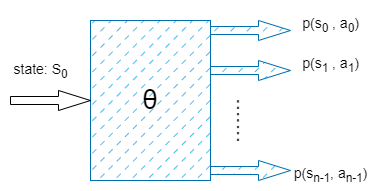
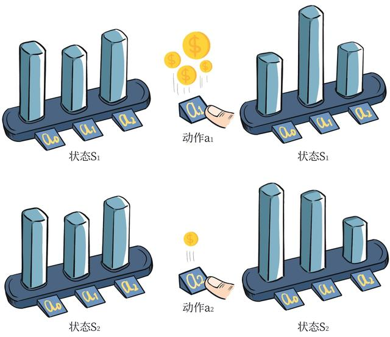

### Policy-Gradient
- 参数化策略：(parameterized policy) 
     
- 目标函数: (metric)

    $$
    J(\theta) = E_{s_0}[V^{\pi_{\theta}}(s_0)]
    $$

    where $s_0$ represents the initial state, and $V^{\pi_{\theta}}(s_0)$ is the value function of the policy $\pi_{\theta}$ defined by 

    $$
    V^{\pi_{\theta}}(s_0) = E_{\pi}[G_t|S_t = s_0] \quad or \quad V^{\pi_{\theta}}(s_0) = E_{\tau \sim \pi_{\theta}}[R(\tau)|s_0]
    $$

    ??? tip "访问分布（on-policy distribution）"
        Denoted by $\nu^\pi$(s) or simply $d(s)$. It is the distribution of states encountered by the agent when following policy $\pi$. It is defined by

        $$
        \nu^\pi(s) = (1-\gamma)\sum_{t=0}^{\infty}\gamma^tP^\pi_t(s)
        $$

        namely, the probability of visiting state s at time t under policy $\pi$. (1-$\gamma$) is the normalization factor.
        
        consider the following equation:
        
        $$
        \sum_{s_i \in S} \gamma^t P^\pi_t(s_i) = \gamma^t
        $$

        $$
        \sum_{s_i \in S}\sum_{t=0}^\infty \gamma^t P^\pi_t(s_i) = \sum_t^\infty \gamma^t = \frac{1}{1-\gamma}
        $$

        besides, we can define occupancy measure by:

        $$
        \rho^\pi(s,a) = (1-\gamma)\sum_{t=0}^\infty \gamma^t P^\pi_t(s,a) = \nu^\pi(s) \pi(a|s)
        $$

        TODO:
        -  frequency of visiting?

- Intuition of policy gradient:
    
    

- 证明$\nabla_\theta J(\theta) \propto \mathbb{E}_{\pi_{\theta}}\left[Q^{\pi_{\theta}}\nabla_\theta\log\pi_{\theta}(a|s) \right]$ 

    Intuition: `Q` denotes the reward of taking action `a` in state `s` under policy $\pi_{\theta}$, and $\nabla_\theta\log\pi_{\theta}(a|s)$ denotes the gradient of the log probability of taking action `a` in state `s` under policy $\pi_{\theta}$. The expectation of the product of these two terms is proportional to the gradient of the objective function $J(\theta)$. 

    ??? info "Recall the expreesion below"
        $$
        E\left[Q^{\pi_\theta}\pi_\theta(a|s) \right]
        $$

        Q: What does this expression represent? 
        A: Actually, is't the `state value` of `s`
    
    Proof:

    $$
    \begin{aligned}
    J(\theta) = E_{s_0}[V^{\pi_{\theta}}(s_0)]
    \end{aligned}
    $$

    Started from the expression inside the expectation which is the value function of the policy of initial state $s_0$ under policy $\pi_{\theta}$: 

    $$
    \begin{aligned}
    \nabla_\theta V^{\pi_\theta}(s) &= \nabla_\theta(\sum_{a \in A}\pi_\theta(a|s)Q^{\pi_\theta}(s,a)) \\
    \text{Apply the chain rule: } \\
    &= \sum_{a \in A}\nabla_\theta\pi_\theta(a|s)Q^{\pi_\theta}(s,a) + \sum_{a \in A}\pi_\theta(a|s)\nabla_\theta Q^{\pi_\theta}(s,a)\\
    \text{Rewrite the Q function: } \\
    &= \sum_{a \in A}\nabla_\theta\pi_\theta(a|s)Q^{\pi_\theta}(s,a) + \sum_{a \in A}\pi_\theta(a|s)\nabla_\theta \sum_{s',r}P(s',r|s,a)(r + \gamma V^{\pi_\theta}(s'))\\
    \text{Exclude the first term since it's not the function of $\theta$: } \\
    &= \sum_{a \in A}\nabla_\theta\pi_\theta(a|s)Q^{\pi_\theta}(s,a) + \sum_{a \in A}\pi_\theta(a|s)\nabla_\theta \sum_{s',r}P(s',r|s,a)\gamma V^{\pi_\theta}(s')\\
    \text{Then we simply marginalize the reward term: r} \\
    & = \sum_{a \in A}\nabla_\theta\pi_\theta(a|s)Q^{\pi_\theta}(s,a) + \sum_{a \in A}\pi_\theta(a|s)\gamma \sum_{s'}P(s'|s,a)\nabla_\theta V^{\pi_\theta}(s')\\
    \end{aligned}
    $$

    To simplify the expression, we can denote the first term as $\Phi(s)$ and define $d^{\pi_\theta}(s \to x,k)$ as the probability of transitioning from state `s` to state `x` in `k` steps under policy $\pi_\theta$. Then we continue our derivation:

    $$
    \begin{aligned}
    \nabla_\theta V^{\pi_\theta}(s) &= \Phi(s) + \gamma \sum_{a \in A}\pi_\theta(a|s)\sum_{s'}P(s'|s,a)\nabla_\theta V^{\pi_\theta}(s')\\
    & = \Phi(s) + \gamma \sum_{a}\sum{s'}\pi_\theta(a|s)P(s'|s,a)\nabla_\theta V^{\pi_\theta}(s')\\
    \text{Simplify the expression using our definition above: } \\
    & = \Phi(s) + \gamma \sum_{s'}d^{\pi_\theta}(s \to s',1)\nabla_\theta V^{\pi_\theta}(s')\\
    \text{Note that the above expression is a recursive form: } \\
    & = \Phi(s) + \gamma \sum_{s'}d^{\pi_\theta}(s \to s',1)\left(\Phi(s') + \gamma \sum_{s''}d^{\pi_\theta}(s' \to s'',1)\nabla_\theta V^{\pi_\theta}(s'')\right)\\
    \text{Continue the recursion: } \\
    & = \Phi(s) + \gamma \sum_{s'}d^{\pi_\theta}(s \to s',1)\left(\Phi(s') + \gamma \sum_{s''}d^{\pi_\theta}(s' \to s'',1)\left(\Phi(s'') + \gamma \sum_{s'''}d^{\pi_\theta}(s'' \to s''',1)\nabla_\theta V^{\pi_\theta}(s''')\right)\right)\\
    & = \cdots
    \text{Since it can visit every state in the MDP, the recursion be shorten to: } \\
    & = \sum_{x \in S}\sum_{k=0}^{\infty}\gamma^k d^{\pi_\theta}(s \to x,k)\Phi(x)\\
    \end{aligned}
    $$

    Then we define $\eta(s) = E\left[\sum_{k=0}^{\infty}\gamma^k d^{\pi_\theta}(s_0 \to s,k)\right]$. 
    We can finally retract our gaze to the objective function $J(\theta)$:

    $$
    \begin{aligned}
    \nabla_\theta J(\theta) &= \nabla_\theta E_{s_0}[V^{\pi_\theta}(s_0)]\\
    \text{Move the gradient inside the expectation: } \\
    &= E_{s_0}[\nabla_\theta V^{\pi_\theta}(s_0)]\\
    \text{Apply the expression we derived above: } \\
    &= E_{s_0}\left[\sum_{x \in S}\sum_{k=0}^{\infty}\gamma^k d^{\pi_\theta}(s_0 \to x,k) \Phi(x)\right]\\
    &= \sum_{x \in S} E_{s_0}[\sum_{k=0}^{\infty}\gamma^kd^{\pi_\theta}(s_0 \to x,k)]\Phi(x)\\
    &= \sum_{x \in S} \eta(x)\Phi(x)\\
    &= \sum_{s} \eta(s)\Phi(s)\\
    &= \left(\sum_{s} \eta(s)\right)\sum_s \frac{\eta(s)}{\sum_s \eta(s)}\Phi(s)\\
    &\propto \sum_s \frac{\eta(s)}{\sum_s \eta(s)}\Phi(s)\\
    &= \sum_s \nu^{\pi_\theta}(s)\sum_a \nabla_\theta \pi_\theta(a|s)Q^{\pi_\theta}(s,a)\\
    q.e.d
    \end{aligned}_
    $$

    where $\nu^{\pi_\theta}(s)$ is the on-policy distribution of states under policy $\pi_\theta$.11111
